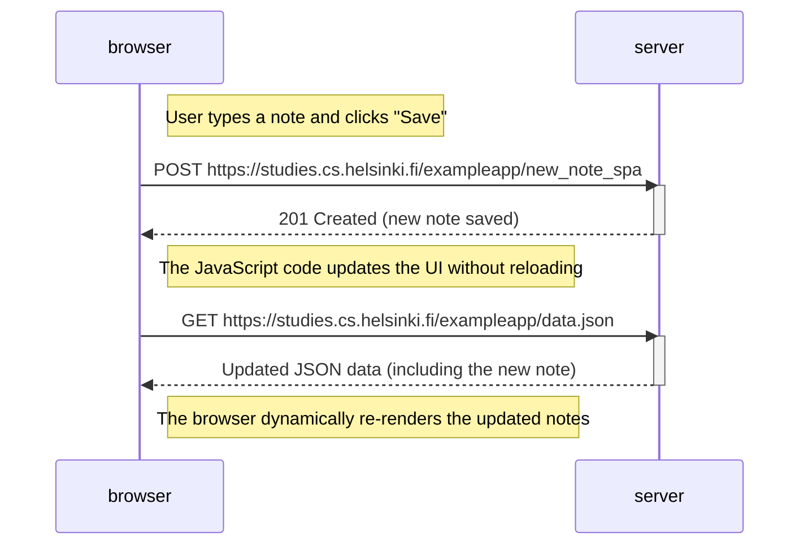

```mermaid
    sequenceDiagram
    participant browser
    participant server

    Note right of browser: User types a note and clicks "Save"

    browser->>server: POST https://studies.cs.helsinki.fi/exampleapp/new_note_spa
    activate server
    server-->>browser: 201 Created (new note saved)
    deactivate server

    Note right of browser: The JavaScript code updates the UI without reloading

    browser->>server: GET https://studies.cs.helsinki.fi/exampleapp/data.json
    activate server
    server-->>browser: Updated JSON data (including the new note)
    deactivate server

    Note right of browser: The browser dynamically re-renders the updated notes

```